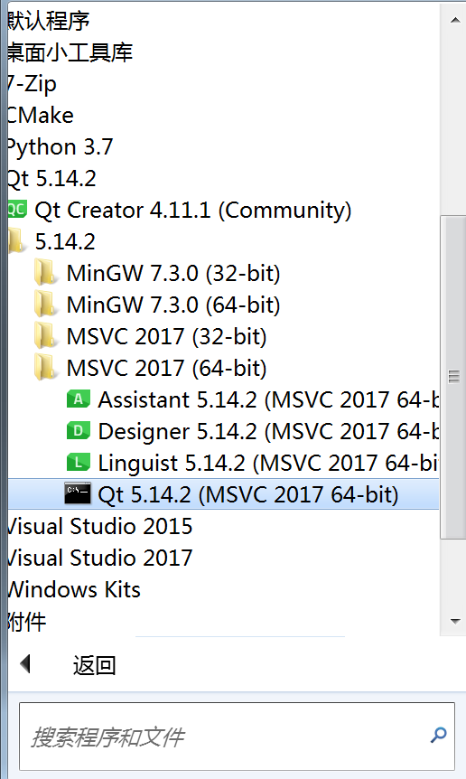
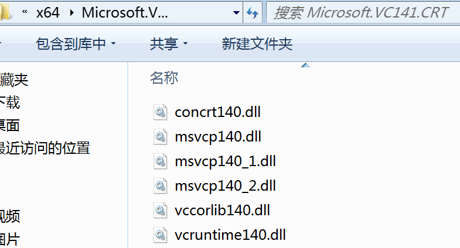
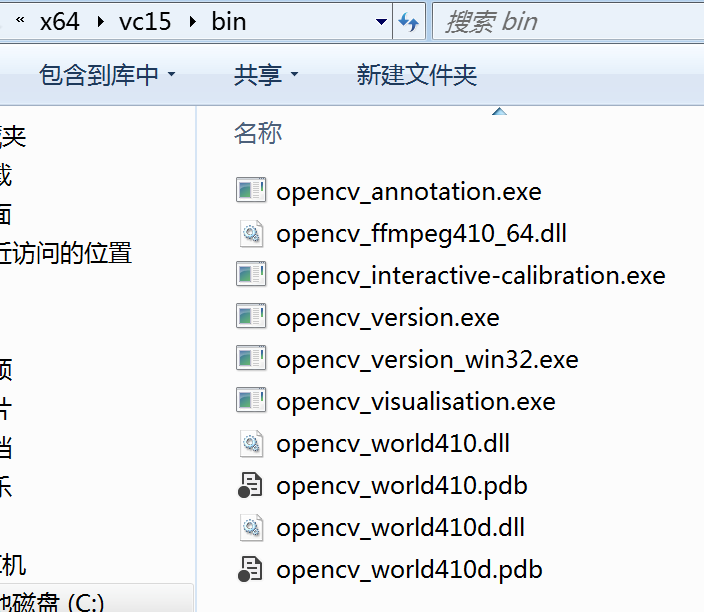

# BadAppple_with_Qt_and_opencv

## 介绍

本项目使用C++配合Qt和opencv播放透明背景的BadApple视频，也适用于其他视频。

## 探索过程以及对应版本的源代码

### 版本1：将本地的mp4视频进行图像二值化，重点用黑色表示，并以原帧率播放处理后的图像。播放完成后使用FFmpeg保存处理后的视频。

以下是一个简单的C++代码示例，使用OpenCV库来读取本地MP4视频，进行图像二值化处理，并使用FFmpeg保存处理后的视频。此代码假定您已经在您的Visual Studio项目中配置了OpenCV，并且FFmpeg的`ffmpeg.exe`位于系统的PATH环境变量中，或者您可以指定其完整路径。

```cpp
#include <opencv2/opencv.hpp>
#include <iostream>
#include <string>
int main() {
    // 视频文件路径
    std::string inputVideoPath = "input.mp4";
    std::string outputVideoPath = "output.mp4";
    // 打开视频文件
    cv::VideoCapture cap(inputVideoPath);
    if (!cap.isOpened()) {
        std::cerr << "Error: Could not open video." << std::endl;
        return -1;
    }
    // 获取视频的属性
    int frameWidth = static_cast<int>(cap.get(cv::CAP_PROP_FRAME_WIDTH));
    int frameHeight = static_cast<int>(cap.get(cv::CAP_PROP_FRAME_HEIGHT));
    double fps = cap.get(cv::CAP_PROP_FPS);
    // 创建VideoWriter对象
    cv::VideoWriter writer;
    int fourcc = cv::VideoWriter::fourcc('m', 'p', '4', 'v'); // 设置编码格式
    writer.open(outputVideoPath, fourcc, fps, cv::Size(frameWidth, frameHeight), false); // 设置为灰度模式
    if (!writer.isOpened()) {
        std::cerr << "Error: Could not open VideoWriter." << std::endl;
        return -1;
    }
    cv::Mat frame, gray, binary;
    while (true) {
        // 读取一帧
        cap >> frame;
        if (frame.empty()) {
            break; // 视频播放完毕
        }
        // 转换为灰度图像
        cv::cvtColor(frame, gray, cv::COLOR_BGR2GRAY);
        // 二值化处理
        cv::threshold(gray, binary, 128, 255, cv::THRESH_BINARY);
        // 显示处理后的帧
        cv::imshow("Binary Video", binary);
        // 写入二值化后的帧
        writer << binary;
        // 按 'q' 键退出
        if (cv::waitKey(1000 / fps) == 'q') {
            break;
        }
    }
    // 释放资源
    cap.release();
    writer.release();
    cv::destroyAllWindows();
    // 使用FFmpeg将OpenCV的输出转换为mp4格式（如果需要的话）
    std::string ffmpegCommand = "ffmpeg -i output.avi -c:v libx264 -crf 23 -preset veryfast " + outputVideoPath;
    system(ffmpegCommand.c_str());
    return 0;
}
```

请注意以下几点：
1. 在上面的代码中，我使用了OpenCV的内置功能来处理视频和图像，并假设视频是彩色的。二值化处理使用了简单的全局阈值方法，您可能需要根据视频内容调整阈值。
2. OpenCV的`VideoWriter`默认可能不支持mp4格式，因此代码中首先保存为.avi格式，然后使用FFmpeg将其转换为mp4格式。如果您已经安装了支持mp4格式的OpenCV，则可以直接使用mp4格式。
3. `system`函数用于调用FFmpeg命令行工具，这依赖于FFmpeg已经被正确安装在您的系统上，并且`ffmpeg.exe`在系统PATH中。
4. 在运行此代码之前，请确保已经正确安装了OpenCV库，并在Visual Studio项目中配置了包含目录、库目录和链接器输入。
5. 根据您的需求，可能需要调整`cv::threshold`函数中的阈值参数。
6. 代码中的`1000 / fps`是用于计算每帧之间的等待时间，以保持原始帧率。如果您的视频帧率非常高，可能需要调整这一点，以避免播放过快。


### 版本2：修改需求：将视频中的图像二值化后，将白色部分变为透明背景，使得在播放视频时可以看到桌面

#### 代码

```cpp
#include <opencv2/opencv.hpp>
#include <QApplication>
#include <QWidget>
#include <QImage>
#include <QPainter>
#include <QTimer>

class VideoPlayer : public QWidget {
public:
    VideoPlayer(const std::string& videoPath) {
        cap.open(videoPath);
        if (!cap.isOpened()) {
            std::cerr << "Error opening video file" << std::endl;
            return;
        }

        fps = cap.get(cv::CAP_PROP_FPS);
        timer = new QTimer(this);
        connect(timer, &QTimer::timeout, this, &VideoPlayer::updateFrame);
        timer->start(1000 / fps);
    }

protected:
    void paintEvent(QPaintEvent* event) override {
        QPainter painter(this);
        if (!frame.empty()) {
            QImage img(frame.data, frame.cols, frame.rows, frame.step, QImage::Format_ARGB32);
            painter.drawImage(QPoint(0, 0), img);
        }
    }

private:
    void updateFrame() {
        cap >> frame;
        if (frame.empty()) {
            timer->stop();
            return;
        }

        cv::cvtColor(frame, frame, cv::COLOR_BGR2GRAY);
        cv::threshold(frame, frame, 128, 255, cv::THRESH_BINARY);

        // Convert white to transparent
        cv::Mat rgba;
        cv::cvtColor(frame, rgba, cv::COLOR_GRAY2BGRA);
        for (int y = 0; y < rgba.rows; ++y) {
            for (int x = 0; x < rgba.cols; ++x) {
                cv::Vec4b& pixel = rgba.at<cv::Vec4b>(y, x);
                if (pixel[0] == 255 && pixel[1] == 255 && pixel[2] == 255) {
                    pixel[3] = 0; // Set alpha to 0 for white pixels
                }
            }
        }

        frame = rgba;
        update();
    }

    cv::VideoCapture cap;
    cv::Mat frame;
    QTimer* timer;
    double fps;
};

int main(int argc, char* argv[]) {
    QApplication app(argc, argv);

    VideoPlayer player("path_to_your_video.mp4");
    player.resize(800, 600);
    player.setAttribute(Qt::WA_TranslucentBackground);
    player.setWindowFlags(Qt::FramelessWindowHint);
    player.show();

    return app.exec();
}
```

**说明**

1. **VideoPlayer类**：继承自QWidget，用于显示视频帧。
2. **构造函数**：打开视频文件并设置定时器以按原帧率更新帧。
3. **paintEvent**：重写paintEvent以绘制当前帧。
4. **updateFrame**：定时器触发时调用，读取新帧并进行二值化处理，将白色区域变为透明。
5. **main函数**：创建QApplication和VideoPlayer实例，并显示窗口。

**修改点**

1. **将白色区域变为透明**：在`updateFrame`函数中，将白色像素的alpha通道设置为0。
2. **设置窗口透明背景**：在`main`函数中，设置`player.setAttribute(Qt::WA_TranslucentBackground)`和`player.setWindowFlags(Qt::FramelessWindowHint)`，使窗口背景透明且无边框。


### 版本3：在2的基础上增加功能：先选择视频文件，播放完成后退出。

#### 代码

```cpp
#include <opencv2/opencv.hpp>
#include <QApplication>
#include <QWidget>
#include <QImage>
#include <QPainter>
#include <QTimer>
#include <QFileDialog>

class VideoPlayer : public QWidget {
public:
	VideoPlayer(const std::string& videoPath) {
		cap.open(videoPath);
		if (!cap.isOpened()) {
			std::cerr << "Error opening video file" << std::endl;
			return;
		}

		fps = cap.get(cv::CAP_PROP_FPS);
		int width = static_cast<int>(cap.get(cv::CAP_PROP_FRAME_WIDTH));
		int height = static_cast<int>(cap.get(cv::CAP_PROP_FRAME_HEIGHT));
		resize(width, height);

		timer = new QTimer(this);
		connect(timer, &QTimer::timeout, this, &VideoPlayer::updateFrame);
		timer->start(1000 / fps);
	}

protected:
	void paintEvent(QPaintEvent* event) override {
		QPainter painter(this);
		if (!frame.empty()) {
			QImage img(frame.data, frame.cols, frame.rows, frame.step, QImage::Format_ARGB32);
			painter.drawImage(QPoint(0, 0), img);
		}
	}

private:
	void updateFrame() {
		cap >> frame;
		if (frame.empty()) {
			timer->stop();
			QApplication::quit(); // Quit the application when video ends
			return;
		}

		cv::cvtColor(frame, frame, cv::COLOR_BGR2GRAY);
		cv::threshold(frame, frame, 128, 255, cv::THRESH_BINARY);

		// Convert white to transparent
		cv::Mat rgba;
		cv::cvtColor(frame, rgba, cv::COLOR_GRAY2BGRA);
		for (int y = 0; y < rgba.rows; ++y) {
			for (int x = 0; x < rgba.cols; ++x) {
				cv::Vec4b& pixel = rgba.at<cv::Vec4b>(y, x);
				if (pixel[0] == 255 && pixel[1] == 255 && pixel[2] == 255) {
					pixel[3] = 0; // Set alpha to 0 for white pixels
				}
			}
		}

		frame = rgba;
		update();
	}

	cv::VideoCapture cap;
	cv::Mat frame;
	QTimer* timer;
	double fps;
};

int main(int argc, char* argv[]) {
	QApplication app(argc, argv);

	// Open a file dialog to select a video file
	QString videoPath = QFileDialog::getOpenFileName(nullptr, "Open Video File", "", "Video Files (*.mp4 *.avi *.mkv)");
	if (videoPath.isEmpty()) {
		return -1; // Exit if no file is selected
	}

	VideoPlayer player(videoPath.toStdString());
	player.setAttribute(Qt::WA_TranslucentBackground);
	player.setWindowFlags(Qt::FramelessWindowHint);
	player.show();

	return app.exec();
}
```

#### exe文件以及依赖项导出

在vs2017中调整为Release x64（已经配好了opencv和qt），重新生成解决方案，找到生成的exe（在Release x64）的存放位置，自己在方便的地方新建一个文件夹，将那个位置里的东西拷贝到这里。

开始菜单里找到qt快捷目录，打开QT命令行MSVC2017工具，进入进入之前的文件所在目录，输入命令`windeployqt.exe xxx.exe` ，xxx指的是先前生成的release文件夹里的可执行文件名，然后回车，此时将生成qt各种资源文件，于是该目录下多了很多文件。



在vs2017安装目录中查找QT应用程序运行所需的VC相关dll文件。打开vs2017安装目录，进入Redist->MSVC->14.16.27012子目录，选中x64，打开Microsoft.VC141.CRT目录，复制里的dll文件（它们的位置：`C:\Program Files (x86)\Microsoft Visual Studio\2017\Community\VC\Redist\MSVC\14.16.27012\x64\Microsoft.VC141.CRT`），粘贴到exe文件的目录下。



找出opencv dll库的位置，将里面的东西全选（它们的位置：`C:\opencv\build\x64\vc15\bin`），并拷贝到exe文件的目录下。



最后将exe文件所在的目录打包为zip压缩包即可。


### 版本4：在3的基础上增加播放原视频内的音频的功能并处理了音视频不同步


#### 代码

```cpp
#include <opencv2/opencv.hpp>
#include <QApplication>
#include <QWidget>
#include <QImage>
#include <QPainter>
#include <QTimer>
#include <QFileDialog>
#include <QProcess>
#include <chrono>

class VideoPlayer : public QWidget {
public:
	VideoPlayer(const std::string& videoPath) {
		cap.open(videoPath);
		if (!cap.isOpened()) {
			std::cerr << "Error opening video file" << std::endl;
			return;
		}

		fps = cap.get(cv::CAP_PROP_FPS);
		int width = static_cast<int>(cap.get(cv::CAP_PROP_FRAME_WIDTH));
		int height = static_cast<int>(cap.get(cv::CAP_PROP_FRAME_HEIGHT));
		resize(width, height);

		timer = new QTimer(this);
		connect(timer, &QTimer::timeout, this, &VideoPlayer::updateFrame);
		timer->start(1000 / fps);

		// Start audio playback using FFmpeg
		audioProcess = new QProcess(this);
		audioProcess->start("ffplay", QStringList() << "-nodisp" << "-autoexit" << "-sync" << "audio" << QString::fromStdString(videoPath));

		// Initialize the start time
		startTime = std::chrono::high_resolution_clock::now();
	}

	~VideoPlayer() {
		if (audioProcess) {
			audioProcess->terminate();
			audioProcess->waitForFinished();
		}
	}

protected:
	void paintEvent(QPaintEvent* event) override {
		QPainter painter(this);
		if (!frame.empty()) {
			QImage img(frame.data, frame.cols, frame.rows, frame.step, QImage::Format_ARGB32);
			painter.drawImage(QPoint(0, 0), img);
		}
	}

private:
	void updateFrame() {
		auto currentTime = std::chrono::high_resolution_clock::now();
		std::chrono::duration<double> elapsed = currentTime - startTime;
		double elapsedSeconds = elapsed.count();

		// Calculate the frame index based on elapsed time and fps
		int frameIndex = static_cast<int>(elapsedSeconds * fps);

		// Seek to the correct frame
		cap.set(cv::CAP_PROP_POS_FRAMES, frameIndex);
		cap >> frame;
		if (frame.empty()) {
			timer->stop();
			QApplication::quit(); // Quit the application when video ends
			return;
		}

		cv::cvtColor(frame, frame, cv::COLOR_BGR2GRAY);
		cv::threshold(frame, frame, 128, 255, cv::THRESH_BINARY);

		// Convert white to transparent
		cv::Mat rgba;
		cv::cvtColor(frame, rgba, cv::COLOR_GRAY2BGRA);
		for (int y = 0; y < rgba.rows; ++y) {
			for (int x = 0; x < rgba.cols; ++x) {
				cv::Vec4b& pixel = rgba.at<cv::Vec4b>(y, x);
				if (pixel[0] == 255 && pixel[1] == 255 && pixel[2] == 255) {
					pixel[3] = 0; // Set alpha to 0 for white pixels
				}
			}
		}

		frame = rgba;
		update();
	}

	cv::VideoCapture cap;
	cv::Mat frame;
	QTimer* timer;
	double fps;
	QProcess* audioProcess;
	std::chrono::high_resolution_clock::time_point startTime;
};

int main(int argc, char* argv[]) {
	QApplication app(argc, argv);

	// Open a file dialog to select a video file
	QString videoPath = QFileDialog::getOpenFileName(nullptr, "Open Video File", "", "Video Files (*.mp4 *.avi *.mkv)");
	if (videoPath.isEmpty()) {
		return -1; // Exit if no file is selected
	}

	VideoPlayer player(videoPath.toStdString());
	player.setAttribute(Qt::WA_TranslucentBackground);
	player.setWindowFlags(Qt::FramelessWindowHint);
	player.show();

	return app.exec();
}
```


>代码解释： `ffplay` 处理了音频的同步，还需要确保视频帧的更新与音频的播放时间一致：使用 `std::chrono` 来计算从开始播放到现在经过的时间，并根据这个时间来计算当前应该显示的帧索引。然后，我们使用 `cv::VideoCapture::set` 方法来跳转到正确的帧。

>4版本相较于3版本：exe文件运行时的cpu和内存占用更高了。

>代码的依赖增加：代码中使用 `FFmpeg` 的 `ffplay` 工具来播放视频的音频部分。（Releases内未放置`ffplay`，需使用者自行安装并添加到path环境变量。）